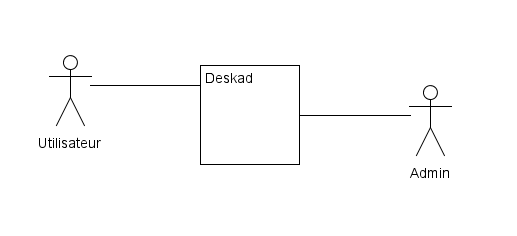
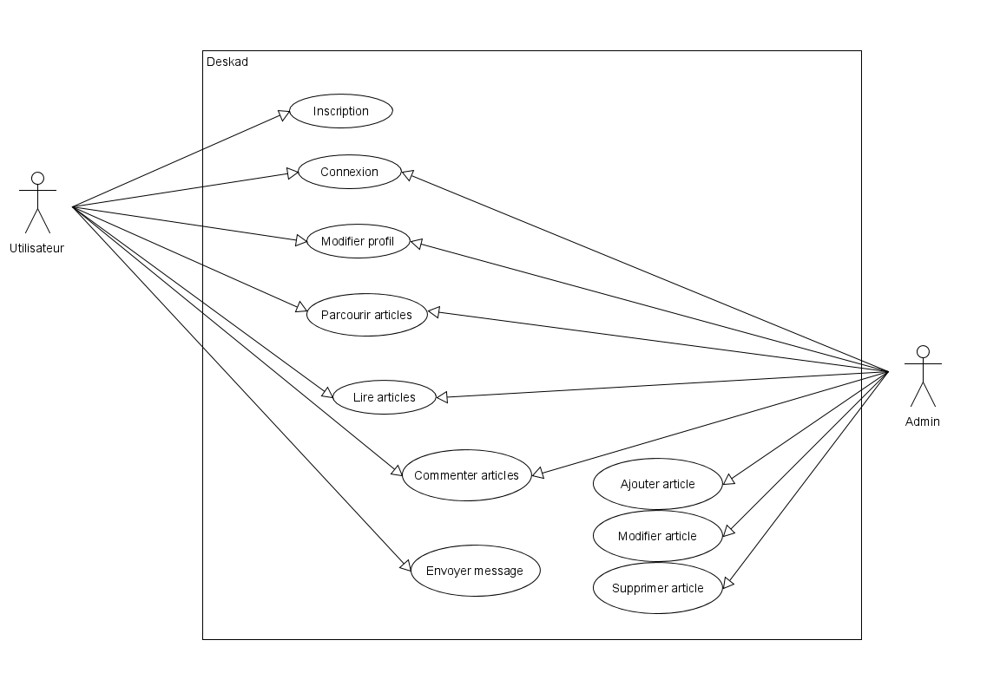
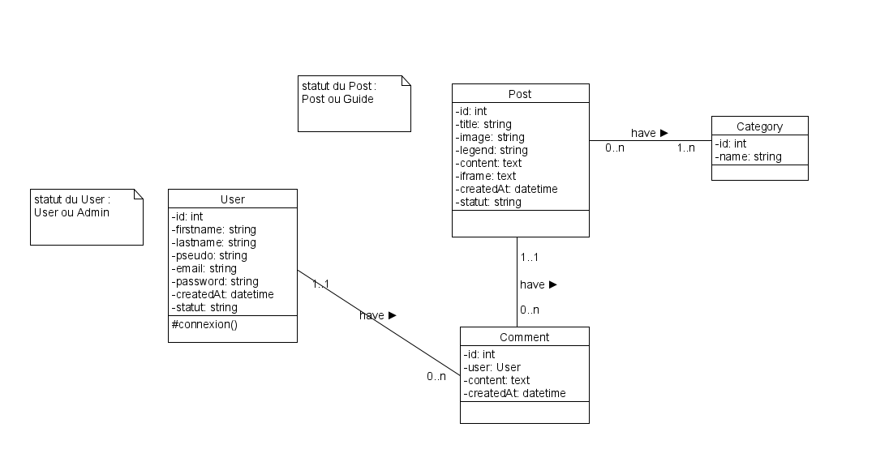

# Cahier des charges

# Description du projet

Un blog qui me permet de partager des articles et des guides sur différents sujets (développement, musique, jeux vidéo, etc...).

- 1ère itération sans framework.
- 2ème itération avec Bootstrap
- 3ème itération avec Symfony
- 4ème itération avec Vue.js

# Fonctionnalités

Utilisateurs :

- Inscription
- Connexion
- Modifier profil
- Déconnexion
- Lire les articles
- Commenter les articles

Admin :

- Créer un article
    - Format différent pour les musiques (vidéo YouTube)
- Partager un article
    - Permettre de copier le lien de la page
- Articles rangés par catégories

# Design

## Inspirations

Inspiré du site “Typewolf”

[What's Trending in Type · Typewolf](https://www.typewolf.com/)

## Couleurs

### Fond

Fond sombre avec polices en blanc.

Pinot noir

```css
background: #4b6cb7;  /* fallback for old browsers */
background: -webkit-linear-gradient(to right, #182848, #4b6cb7);  /* Chrome 10-25, Safari 5.1-6 */
background: linear-gradient(to right, #182848, #4b6cb7); /* W3C, IE 10+/ Edge, Firefox 16+, Chrome 26+, Opera 12+, Safari 7+ */
```

Royal

```css
background: #141E30;  /* fallback for old browsers */
background: -webkit-linear-gradient(to right, #243B55, #141E30);  /* Chrome 10-25, Safari 5.1-6 */
background: linear-gradient(to right, #243B55, #141E30); /* W3C, IE 10+/ Edge, Firefox 16+, Chrome 26+, Opera 12+, Safari 7+ */
```

# Contenu du projet

## Accueil

- En colonnes au milieu de la page
- Titre + sous-titre
    - Deskad, Blog made in Quimper
- Menu de navigation
    - Articles, Guides, Contact
- Bouton de connexion / profil
- 10 derniers articles
- Footer

## Articles

- 2 colonnes
- A gauche les catégories
- A droite les articles

# Outils

## Cahier des charges

- Notion

## Diagrammes

- UMLet

## Modèle Conceptuel de Données

- jMerise

## Base de données

- MySQL / phpmyadmin

# Diagrammes

## Cas système



## Cas utilisation



## Classes



